# 🎬 CinemaTicket - Flutter Mobile App for Cinema Ticket Bookingi

## 📝 **Project Overview**
CinemaTicket adalah aplikasi mobile inovatif yang dikembangkan menggunakan Flutter untuk mempermudah proses pemesanan tiket bioskop. Proyek ini berfokus pada antarmuka pengguna yang intuitif, memberikan pengalaman yang lancar untuk mencari film, memilih tempat duduk, hingga memesan tiket.

## 👥 **Project Team**
1. Dimas Kurniawan
2. Muhammad Alfitrah
3. Mulyani
4. Sulthan Juanda Al-Muttaqin
5. Vidya Ayu Ningtyas
6. Zamhur
   
## 🚀 **Features**
- 🎥 Browse Latest Movies: Menampilkan daftar film terbaru sesuai kategori, seperti:
  - Film Indonesia
  - Film Horor
  - Film India
  - Film English
    
- 🎟️ Real-time Seat Selection: Pilih kursi favorit Anda secara real-time dengan tampilan visual yang jelas.
- 📅 Show Schedules: Melihat jadwal tayang film secara mudah dan interaktif.
- 🍔 Food Ordering Page: Halaman pemesanan makanan dan minuman untuk melengkapi pengalaman bioskop.
- 🪑 Seat Reservation Page: Halaman pemilihan kursi untuk pemesanan tiket.
- 🧑‍💼 Profile: Halaman profil pengguna untuk melihat dan mengelola informasi pribadi.
  
## 🔧 **How to Start or Run the Project**

#### 1. Clone Repository
Clone proyek ke komputer lokal Anda:
```bash
git clone https://github.com/Dimas391/Pemesanan_Tiket_Bioskop.git
```
      
#### 2. Masuk ke Direktori Proyek
Navigasikan ke folder proyek yang baru saja di-clone:
```bash
cd Pemesanan_Tiket_Bioskop
```      
   
#### 3. Instalasi Flutter dan Dependencies
Pastikan Flutter sudah terinstal di sistem Anda.
Lalu, instal semua dependensi yang diperlukan proyek:
```bah
flutter pub get
```      

#### 4. Jalankan Proyek
kemudian jalankan proyek menggunakan perintah berikut:
```bah
flutter run
```

## 📸 **Hasil Project**
Berikut adalah beberapa Tampilan dari aplikasi CinemaTicket:

#### halaman login
Halaman login adalah bagian pertama yang akan dijumpai oleh pengguna saat mengakses aplikasi pemesanan tiket. Tujuan dari halaman ini adalah untuk mengautentikasi pengguna sebelum mereka dapat mengakses berbagai fitur dalam aplikasi.

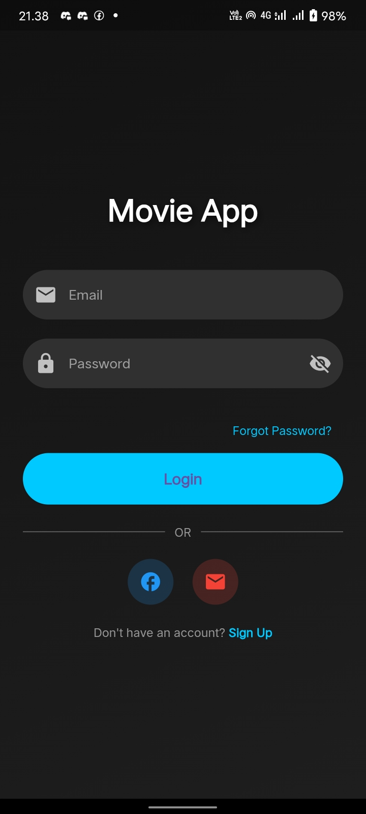

#### halaman Beranda
Halaman beranda adalah halaman utama yang akan dilihat oleh pengguna setelah berhasil login ke aplikasi pemesanan tiket. Halaman ini menyediakan berbagai fitur untuk memudahkan pengguna dalam menemukan dan memilih film yang ingin ditonton. Salah satu fitur utama pada halaman beranda adalah **Browse Latest Movies**, yang menampilkan daftar film terbaru berdasarkan kategori seperti film india, horor, inggris, dan indonesia.

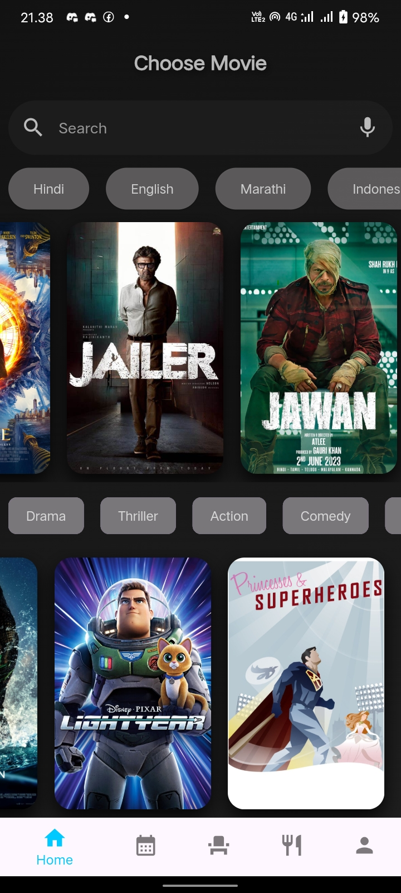

#### halaman Daftar Film
Aplikasi Tiket menyediakan berbagai kategori film terbaru untuk memudahkan pengguna dalam menemukan film yang sesuai dengan preferensi mereka. Berikut adalah kategori film yang dapat dipilih oleh pengguna:
- **Film Indonesia**
  Menampilkan film-film terbaru yang berasal dari Indonesia. Kategori ini berisi berbagai genre film yang populer di kalangan penonton Indonesia. Pengguna   dapat menemukan film-film terbaru dari berbagai genre seperti drama, komedi, aksi, dan lainnya yang diproduksi oleh sineas Indonesia.
-  **Film Horor**
   Kategori ini menampilkan film-film bergenre horor terbaru. Cocok untuk pengguna yang menyukai ketegangan, cerita seram, dan pengalaman menakutkan di       layar lebar. Film-film horor dalam kategori ini meliputi berbagai subgenre, seperti horor supernatural, slasher, thriller psikologis, dan lainnya.
- **Film India (Bollywood)**
  Menampilkan film-film terbaru dari industri film India, yang lebih dikenal dengan sebutan Bollywood. Pengguna dapat menemukan berbagai film dengan genre   seperti romantis, drama, aksi, musikal, dan komedi yang terkenal di kalangan penggemar film India di seluruh dunia.
- **Film English**
  Kategori ini menyajikan film-film terbaru berbahasa Inggris, termasuk film-film Hollywood yang sedang populer. Pengguna yang tertarik dengan film          internasional, terutama dari industri film besar seperti Hollywood, dapat menemukan berbagai film dari berbagai genre seperti aksi, petualangan, komedi,   fiksi ilmiah, dan lainnya.

<div style="display: flex; justify-content: space-between;">
  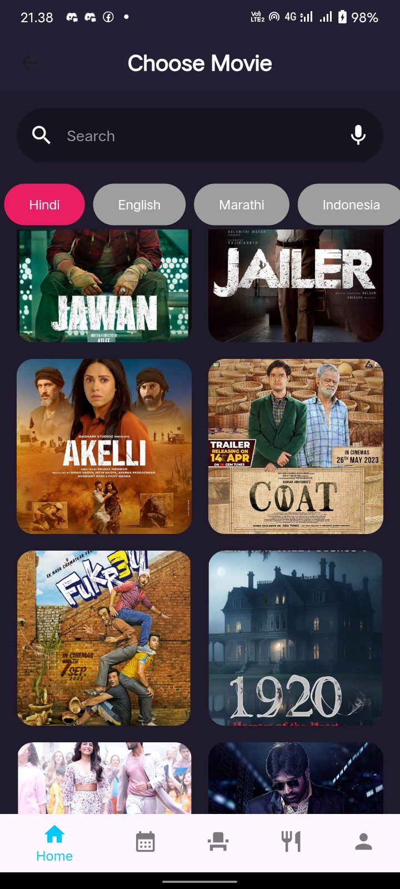
  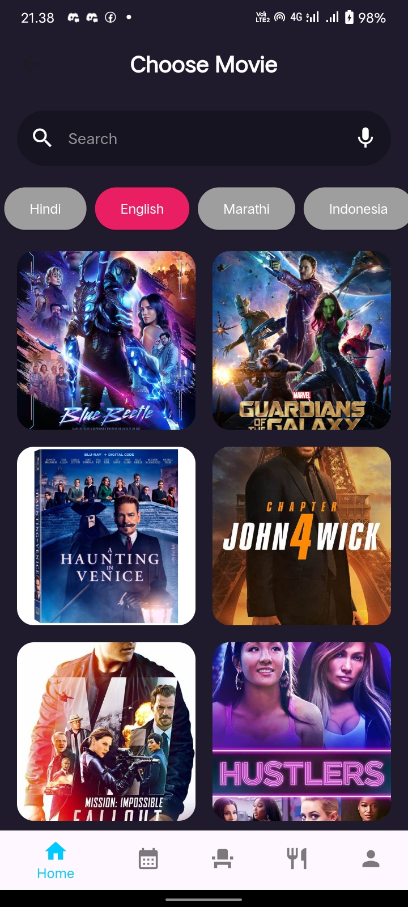
  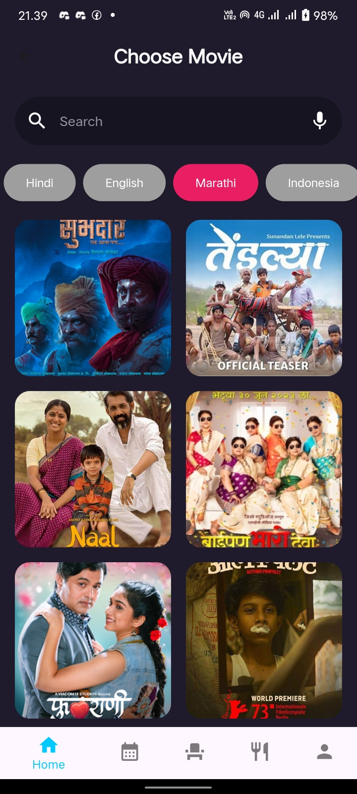
  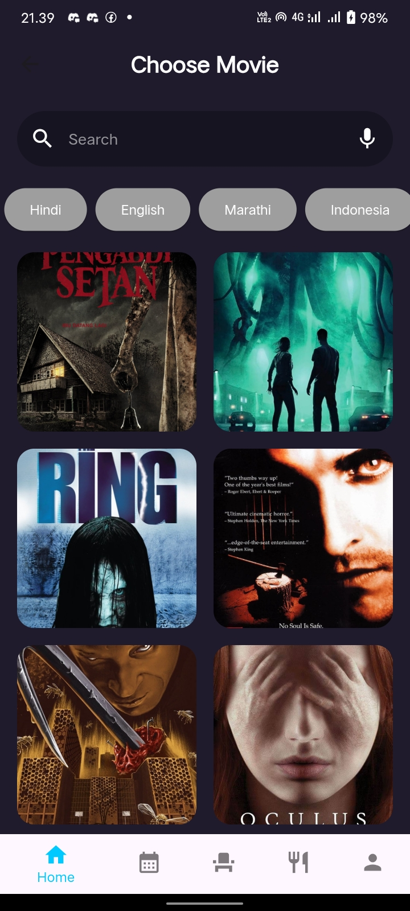
</div>

#### halaman Pemilihan Jadwal Tayang

Halaman pemilihan jadwal ini memungkinkan pengguna untuk menentukan waktu yang diinginkan dengan mudah. Di bagian atas, pengguna dapat melihat informasi tentang film yang akan ditonton. Di bawahnya, terdapat opsi pemilihan tanggal yang disusun dalam format hari dan tanggal, sehingga pengguna dapat memilih hari yang sesuai. Setelah memilih tanggal, pengguna dapat melihat dan memilih jam penayangan yang tersedia, yang ditampilkan dalam kotak-kotak berisi pilihan waktu. Untuk melanjutkan proses pemesanan, pengguna cukup menekan tombol "Reserve Now" di bagian bawah halaman. Desain halaman ini dibuat dengan tampilan modern dan intuitif, memadukan warna gradien untuk memberikan pengalaman yang nyaman dan menarik.

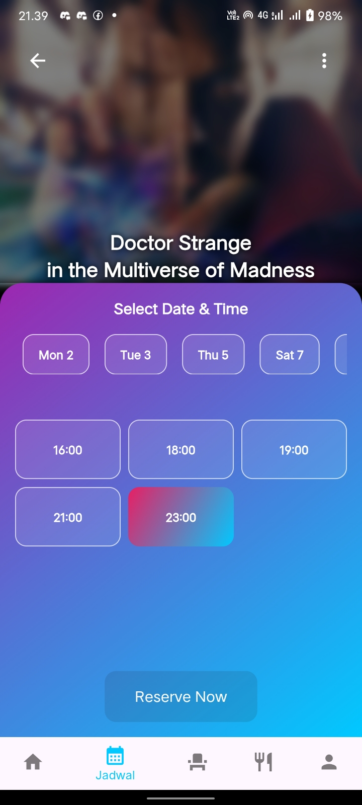

#### halaman Pemilihan Kursi
Ini adalah halaman pemesanan kursi bioskop yang dirancang untuk mempermudah pengguna dalam memilih tempat duduk secara interaktif. Di bagian atas halaman terdapat judul "Choose Seats," yang menunjukkan bahwa ini adalah tahap pemilihan kursi. Setiap kursi ditampilkan dalam bentuk ikon kecil, dengan statusnya ditandai menggunakan warna. Kursi berwarna putih menandakan ketersediaan, merah menunjukkan kursi yang sudah dipesan, dan hijau menandakan kursi yang telah dipilih oleh pengguna.

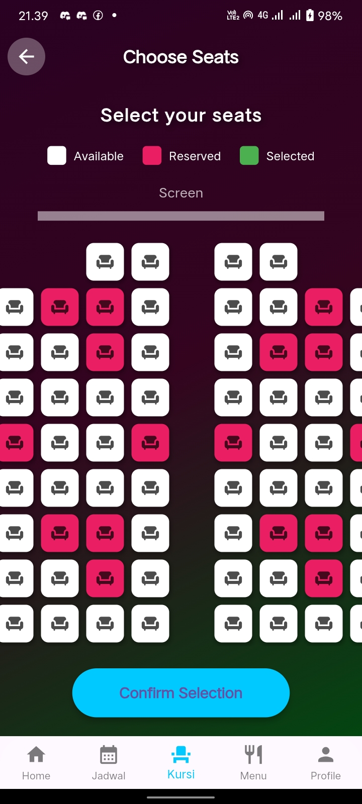

#### halaman Pemesanan Menu Makanan
Di halaman pemesanan menu makanan terdapat fitur pencarian (search bar) memungkinkan pengguna untuk mencari item secara langsung, sementara ikon mikrofon memberikan opsi pencarian melalui perintah suara. Di bawahnya, terdapat tab kategori seperti All, Combos, Snacks, Beverages, dan Popcorn yang membantu mengorganisasikan produk berdasarkan jenisnya sehingga mempermudah navigasi pengguna.Setiap produk ditampilkan dalam bentuk kartu yang mencakup informasi penting seperti nama produk, deskripsi (termasuk ukuran, kalori, dan alergen), harga dalam mata uang lokal, serta gambar untuk memvisualisasikan produk tersebut. Desain ini memastikan informasi disampaikan dengan jelas kepada pengguna. Tombol “Add” pada setiap kartu memungkinkan pengguna untuk menambahkan item ke keranjang belanja dengan cepat dan mudah, mendukung pengalaman pemesanan yang efisien.
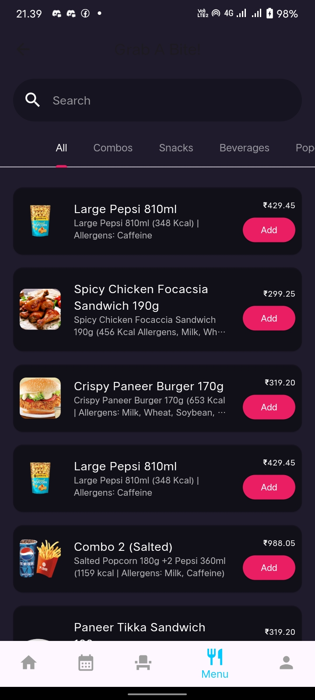

#### halaman Booking

<div style="display: flex; justify-content: space-between;">
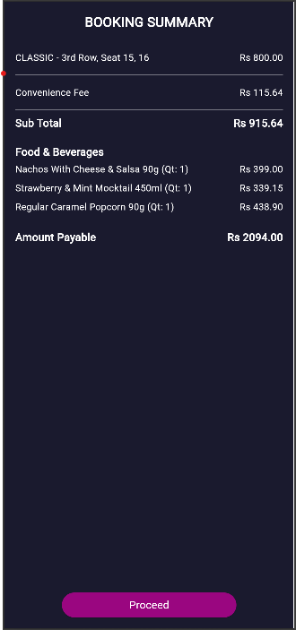
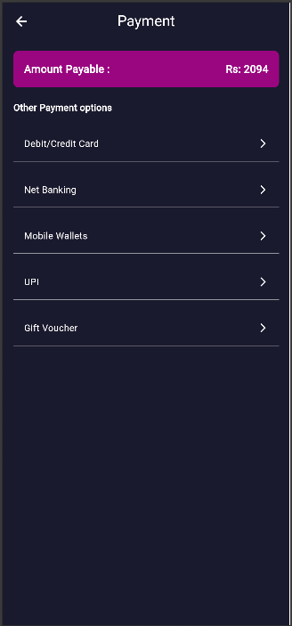
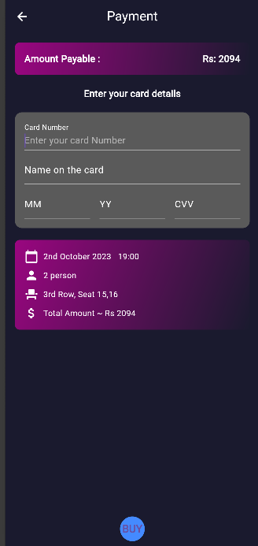
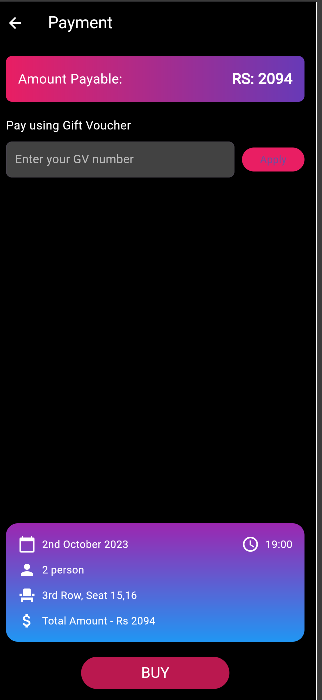
</div>


#### halaman Profile

Halaman profil yang terdiri dari dua halaman utama. Halaman pertama (kiri) adalah menu profil yang mencakup berbagai fitur seperti "Pesanan Anda" untuk melihat atau membeli tiket, "Stream Library" untuk streaming video, "Bayar Kartu Kredit" untuk pembayaran, "Pusat Bantuan" untuk bantuan, "Akun & Pengaturan " untuk pengaturan profil, "Rewards" untuk menukarkan poin, "Offers" untuk promo terbaru, dan "Food & Beverages" untuk memesan makanan. Halaman kedua (kanan) adalah formulir edit profil yang memungkinkan pengguna memperbarui nomor telepon, email, dan detail pribadi dengan tombol "Simpan Perubahan" di bagian bawah untuk menyimpan perubahan. 

<div style="display: flex; justify-content: space-between;">
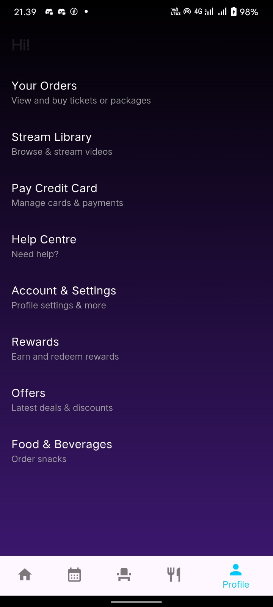
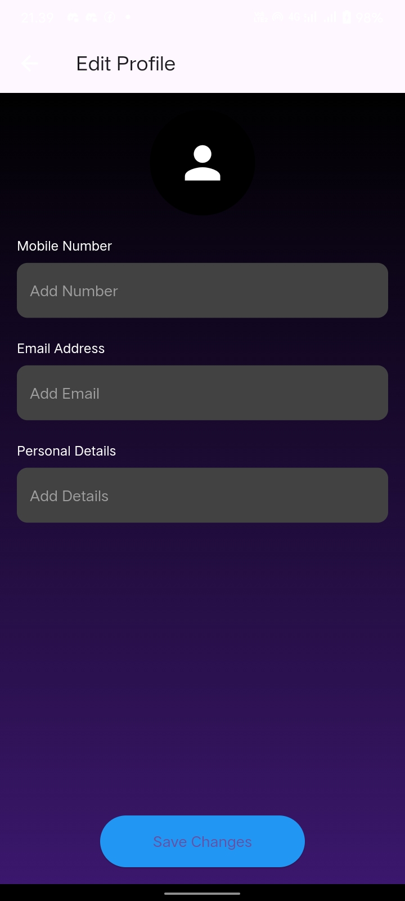
</div>

## 🎬 **Final Thoughts**
CinemaTicket dirancang untuk memberikan gambaran antarmuka dan pengalaman pengguna dalam memesan tiket bioskop. Proyek ini berfokus pada desain dan tata letak yang modern, memberikan ilustrasi bagaimana sebuah aplikasi pemesanan tiket bioskop dapat terlihat dan berfungsi. Harap dicatat bahwa ini hanya merupakan tampilan antarmuka (mockup) tanpa fungsionalitas penuh. Kami berharap tampilan ini dapat memberikan inspirasi atau menjadi referensi dalam pengembangan aplikasi serupa.

## 📞 **Contact**
- [@Dimas391](https://github.com/Dimas391)
- [@Alfitrah1208](https://github.com/Alfitrah1208)
- [@Juanda435](https://github.com/Juanda435)
- [@Mulyani017](https://github.com/Mulyani017)
- [@vayuningtyas](https://github.com/vayuningtyas)
- [@zamhur23](https://github.com/zamhur23)
  


   


